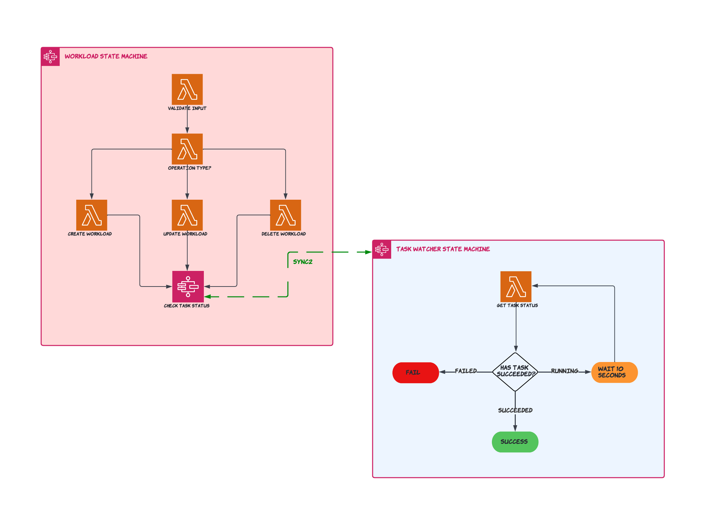

# Stax Orchestrator

This application deploys step functions into your account that you can use to interact with [Stax](https://www.stax.io/) to CUD (create-update-delete) workloads in your AWS Account(s).

Stax provides an open source python [SDK](https://github.com/stax-labs/lib-stax-python-sdk) for use within projects to interact with Stax. We leverage the SDK to create and monitor workload operations within the serverless application.

This project contains source code and supporting files for Stax Orchestrator Serverless Application that you can deploy with the SAM CLI. It includes the following files and folders:

- functions - Python code for the application's lambda functions to deploy workload and monitor the status of the workload task.
- statemachines - Definition for the state machine that orchestrates the stock trading workflow.
- cloudformation - Sample workload templates.
- template.yaml - A template that defines the application's AWS resources.
- Makefile - Run shell commands using make targets for a smooth developer experience.
- events - Json files containing test data to run against your application code locally.
- assets - Diagrams and other assets.

## Stax Orchestrator Workflow Diagram



## Resources

This serverless application deploys the following resources in your AWS Account,

* Workload Step Function - Creates a Stax workload and triggers Task Watcher Step Function to monitor the workload deployment status.
    * Validate Input Lambda - Validates user provided input.
    * Create Workload Lambda - Invokes Stax Api to create a workload.
    * Update Workload Lambda - Invokes Stax Api to create a workload.
    * Delete Workload Lambda - Invokes Stax Api to delete a workload.
* Task Watcher Step Function - Monitors the lifecycle of a workload task in progress and reports with a success/failure to Create Workload Steop Function.
    * Get Task Status Lambda - Invokes Stax Api to get the status of a workload task.

## Use the SAM CLI to build and test the application locally

Build the Lambda functions in your application with the `sam build --use-container` command used within the following `make` command,

```
stax-orchestrator$ make build-app
```

The SAM CLI installs dependencies defined in `requirements.txt`, creates a deployment package, and saves it in the `.aws-sam/build` folder. The `make` command `make prepare-lambda-layer-dir` builds the lambda layer directory using the requirements file.

Once you have built the app locally, try running `make run-create-workload-lambda-locally` to test running the workload create lambda locally.

## Stax API Token

Access to Stax Api's via Stax SDK requires an API token (access key and secret) populated in your account for use with Stax Orchestrator application.

Follow Stax's [guide](https://support.stax.io/hc/en-us/articles/4447111085583-Create-an-API-Token) to create the API token. After you create the token, populate the following SSM parameters into your AWS Account,

* `/orchestrator/stax/access/key` - Stax Access Key
* `/orchestrator/stax/access/key/secret` - Stax Access Key Secret


## Stax Deployment Bucket

Inorder to use Stax to deploy workloads, we need to use s3 bucket accessible by Stax to store our artifacts, our cloudformation templates and package dependencies.

Stax provides a workload `stax-deployment-bucket` manifest deployed in every installation (AU1, US1, EU1) that we can deploy to then start using the s3 bucket to store artifacts. Follow Stax's [guide](https://support.stax.io/hc/en-us/articles/4450989147919-Add-a-Workload-to-the-Workload-Catalog#:~:text=If%20you%20need%20to%20upload%20artifacts%20that%20are%20referenced%20by%20your%20Manifest%2C%20such%20as%20CloudFormation%20templates%2C%20you%20must%3A) to get started.

For workload parameter `StaxRootAccountId` enter the Stax root AWS Account ID from your current installation which can be found [here](https://support.stax.io/hc/en-us/articles/4537150525071-Stax-Installation-Regions). This is required for Stax to `GET` catalogue manifests deployed in the s3 bucket.

Store the name of the bucket in a Ssm parameter with path `/orchestrator/stax/artifact/bucket/name` which will be consumed by Stax Orchestrator. The bucket will be used to store artifacts. An example script can be found in `examples/create_ssm_parameters.py` which can be used to populate SSM parameters.

After you deploy the `stax-deployment-bucket` workload,

* Add a [policy](https://docs.aws.amazon.com/serverless-application-model/latest/developerguide/serverless-sam-template-publishing-applications.html#:~:text=%7B%0A%20%20%20%20%22Version%22%3A%20%222012,aws%3ASourceAccount%22%3A%20%22123456789012%22%0A%20%20%20%20%20%20%20%20%20%20%20%20%20%20%20%20%7D%0A%20%20%20%20%20%20%20%20%20%20%20%20%7D%0A%20%20%20%20%20%20%20%20%7D%0A%20%20%20%20%5D%0A%7D) to allow AWS's Serverless Service access the bucket to get artifacts.

## Deploy Stax Orchestrator

The Serverless Application Model Command Line Interface (SAM CLI) is an extension of the AWS CLI that adds functionality for building and testing Lambda applications. It uses Docker to run your functions in an Amazon Linux environment that matches Lambda.

To use the Stax Orchestrator Application, you need the following tools:

* SAM CLI - [Install the SAM CLI](https://docs.aws.amazon.com/serverless-application-model/latest/developerguide/serverless-sam-cli-install.html)
* [Python 3.9 installed](https://www.python.org/downloads/)
* Docker - [Install Docker community edition](https://hub.docker.com/search/?type=edition&offering=community)
* [Make](https://www.gnu.org/software/make/manual/make.html)
* Workload Deployment Bucket (See Readme's section #Stax Deployment Bucket)

To build and deploy your application for the first time, run the following in your shell:

```bash
make deploy-stax-orchestrator
```

Sam will build the source of your application and deploy Stax Orchestrator to AWS.

## Fetch, tail, and filter Lambda function logs

To simplify troubleshooting, SAM CLI has a command called `sam logs`. `sam logs` lets you fetch logs generated by your deployed Lambda function from the command line. In addition to printing the logs on the terminal, this command has several nifty features to help you quickly find the bug.

`NOTE`: This command works for all AWS Lambda functions; not just the ones you deploy using SAM.

```bash
stax-orchestrator$ sam logs -n CreateWorkloadLambda --stack-name orchestrator-stax --tail
```

You can find more information and examples about filtering Lambda function logs in the [SAM CLI Documentation](https://docs.aws.amazon.com/serverless-application-model/latest/developerguide/serverless-sam-cli-logging.html).

## Creating a workload

* Deploy a Stax workload [catalogue](https://support.stax.io/hc/en-us/articles/4450989147919-Add-a-Workload-to-the-Workload-Catalog).
    * Remember the Catalogue ID of the catalogue deployed as we will need this to create the workload.

* Run `Workload Step Function` step function with the following payload,
    ```
    {
        "aws_account_id": "asd12e3-7c0e-4807-96ee-asd12ec21r2",
        "aws_region": "ap-southeast-2",
        "operation": "create",
        "catalogue_id": "b3437e3b-55e3-4060-9dec-042f18dcf789",
        "catalogue_version_id": "69e4a16c-7c7c-48cf-bb8d-312c43fc0563",
        "workload_name": "orchestrator-stax-demo-vpc",
        "workload_parameters": {
            "Param1": "Value1"
        },
        "workload_tags": {
            "Tag1": "Value1"
        }
    }
    ```
    * aws_account_id - Stax AWS Account ID (UUID) to create workload to.
    * aws_region - The AWS Region to create the workload to.
    * catalogue_id - The ID of the catalogue containing workload manifest.
    * catalogue_version_id (OPTIONAL): Deploy a specific version of the catalogue workload.
    * workload_name - Name of the workload to create (must be unique).
    * workload_parameters - Parameters that get passed into cloudformation templates upon workload deployment.
    * workload_tags - Tags to attach to the workload.

## Updating a workload

* Update a Stax workload [catalogue](https://support.stax.io/hc/en-us/articles/4451005420943-Update-a-Workload).
    * Remember the Catalogue Version ID of the updated catalogue as we will need this to update the workload.

* Run `Workload Step Function` step function with the following payload,
    ```
    {
        "operation": "update",
        "workload_id": "b3437e3b-55e3-4060-9dec-042f18dcf789",
        "catalogue_version_id": "69e4a16c-7c7c-48cf-bb8d-312c43fc0563"
    }
    ```
    * workload_id - The ID of the workload to update
    * catalogue_version_id: The version of the catalogue to update the workload with

## Deleting a workload

* Run `Workload Step Function` step function with the following payload,
    ```
    {
        "operation": "delete",
        "workload_id": "b3437e3b-55e3-4060-9dec-042f18dcf789"
    }
    ```
    * workload_id - The ID of the workload to update
