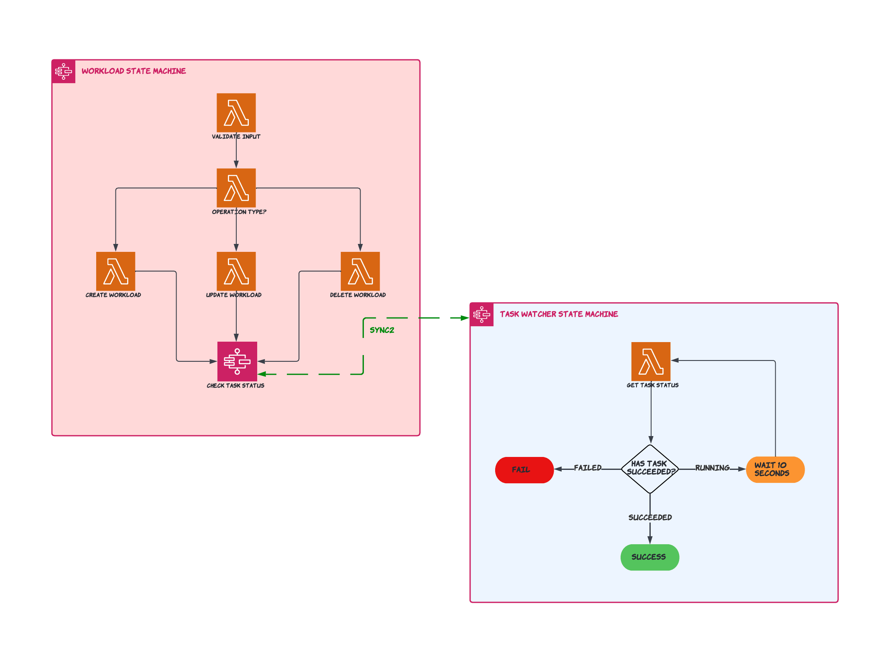

# Stax Orchestrator

This application deploys step functions into your account that you can use to interact with [Stax](https://www.stax.io/) to CUD (create-update-delete) workloads in your AWS Account(s).

Stax provides an open source python [SDK](https://github.com/stax-labs/lib-stax-python-sdk) for use within projects to interact with Stax. We leverage the SDK to create and monitor workload operations within the serverless application.

This project contains source code and supporting files for Stax Orchestrator Serverless Application that you can deploy with the SAM CLI. It includes the following files and folders:

- functions - Python code for the application's lambda functions to deploy workload and monitor the status of the workload task.
- statemachines - Definition for the state machine that orchestrates the stock trading workflow.
- cloudformation - Sample workload templates.
- template.yaml - A template that defines the application's AWS resources.
- Makefile - Run shell commands using make targets for a smooth developer experience.
- events - Json files containing test data to run against your application code locally.
- assets - Diagrams and other assets.

## Stax Orchestrator Architecture Diagram

### Resources Created in your AWS Account

This serverless application deploys the following resources in your AWS Account,

* Workload Step Function - Creates a Stax workload and triggers Task Watcher Step Function to monitor the workload deployment status.
    * Validate Input Lambda - Validates user provided input.
    * Create Workload Lambda - Invokes Stax Api to create a workload.
    * Update Workload Lambda - Invokes Stax Api to create a workload.
    * Delete Workload Lambda - Invokes Stax Api to delete a workload.
* Task Watcher Step Function - Monitors the lifecycle of a workload task in progress and reports with a success/failure to Create Workload Steop Function.
    * Get Task Status Lambda - Invokes Stax Api to get the status of a workload task.

### Pre-deployment requirements

The orchestrator requires API keys to be in the AWS account, follow [pre-deployment steps](docs/pre_deployment.md) to complete this.

### Local Development and Deployment (optional)

This is an optional deployment approach to allow the flexibility to use a forked version of the repository and/or complete feature development and testing.

**We encourage contributions via pull requests, so if there is a feature you have developed and are using, we want to hear about it**.

Follow this guide [here](docs/direct_deployment.md) to deploy directly.

* Add a [policy](https://docs.aws.amazon.com/serverless-application-model/latest/developerguide/serverless-sam-template-publishing-applications.html#:~:text=%7B%0A%20%20%20%20%22Version%22%3A%20%222012,aws%3ASourceAccount%22%3A%20%22123456789012%22%0A%20%20%20%20%20%20%20%20%20%20%20%20%20%20%20%20%7D%0A%20%20%20%20%20%20%20%20%20%20%20%20%7D%0A%20%20%20%20%20%20%20%20%7D%0A%20%20%20%20%5D%0A%7D) to allow AWS's Serverless Service access the bucket to get artifacts.
### Deployment using the AWS Serverless Repository

Deployment of the stax-orchestrator can be completed by the AWS Console, AWS CLI or AWS Cloudformation.
Please following [Deploying Applications](https://docs.aws.amazon.com/serverlessrepo/latest/devguide/serverlessrepo-consuming-applications.html) to use th AWS Console or AWS CLI.

To deploy using AWS Cloudformation, find the serverless application in the AWS Serverless Repository in your AWS account and click "copy Cloudformation template".

### Using the Stax Orchestrator

Please follow [Use of Stax Orchestrator](./docs/use_of_stax_orchestrator.md) for instruction on how to deploy/delete and update Stax Workloads.
